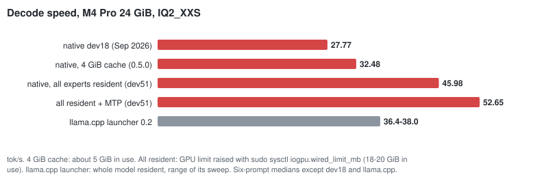
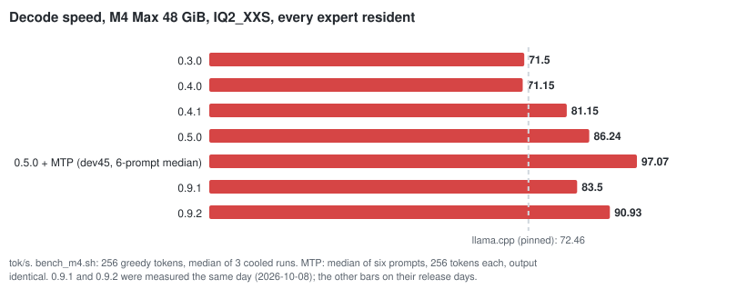
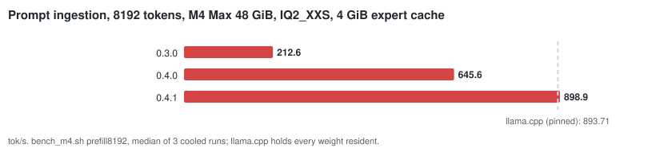

<p align="center">
  
</p>

<h1 align="center">DwarfStar Red Lite</h1>

<p align="center">
  <b>Qwen3-Next-80B on a 24 GiB Mac.</b><br>
  A native Metal runtime written for this one model.
</p>

<p align="center">
  <a href="https://github.com/alfofire2/dwarfstar-red-lite/releases/latest"></a>
  
  
  <a href="LICENSE"></a>
</p>

<p align="center">
  <a href="https://redlite.alfonsodaniello.it/">Website</a> &nbsp;|&nbsp;
  <a href="#install">Install</a> &nbsp;|&nbsp;
  <a href="#measured-performance">Performance</a> &nbsp;|&nbsp;
  <a href="docs/FINDINGS.md">Findings</a> &nbsp;|&nbsp;
  <a href="#limits">Limits</a> &nbsp;|&nbsp;
  <a href="#faq">FAQ</a> &nbsp;|&nbsp;
  <a href="#problems">Problems?</a> &nbsp;|&nbsp;
  <a href="docs/README.md">All docs</a>
</p>

---

Red Lite runs **Qwen3-Next-80B-A3B** and **Qwen3-Coder-Next** locally on Apple Silicon Macs, down to a 24 GB
MacBook Pro.
- **The model:** it has 80 billion parameters, but a token uses only 3 billion of them, because each of its 48
  layers picks 10 of 512 experts.
- **The runtime:** a local LLM engine in C, Objective-C and Metal, built around that one fact in the spirit of
  antirez's [DwarfStar](https://dwarfstar.sh/). It keeps the dense weights resident and treats the experts as a
  cache, streamed from the SSD. With a raised GPU limit it keeps all of them on the GPU.

- **An 80B model on a 24 GiB MacBook Pro:** about 45 tok/s decode on an M4 Pro, 49–58 with MTP speculative
  decoding, which never changes the answer. The llama.cpp launcher reaches 36–38 on the same Mac.
- **Better 2-bit files:** Red Lite's own quantizations have the size of Bartowski's IQ2_XXS (19.3 GB). F2 has a
  6 % lower perplexity; CF2, for Qwen3-Coder-Next, passed 12 of 12 harder agent tasks on a 24 GiB Mac against 7.
- **Checked against llama.cpp** on every change: logits, greedy tokens and long contexts, with llama.cpp used as an
  oracle only, never linked.
- **A local OpenAI-compatible server:** tool calling for coding agents such as pi, two requests at once, steering,
  and prompt states saved to disk. For Qwen3-Coder-Next it drafts tokens from the conversation and verifies them
  exactly (prompt lookup): agent sessions decode 15–25 % faster with the same output (7–10 % on a 24 GiB Mac with the
  4 GiB expert cache).
- **The model's full 262K context:** a 256K-token prompt of real code is read and searched correctly on a 48 GiB
  Mac (24 minutes, 30 GiB); 128K works on a 24 GiB Mac too.

<p align="center">
  
</p>

## Install

**With Homebrew** (from release 0.5.5; no compiler, no source checkout):

```bash
brew tap alfofire2/redlite https://github.com/alfofire2/dwarfstar-red-lite
brew trust --tap alfofire2/redlite     # Homebrew 7 loads formulae from third-party taps only once trusted
brew install redlite
redlite download 24gb && redlite download mtp     # into ~/.redlite/models (REDLITE_MODELS changes it)
redlite doctor && redlite chat
```

The formula installs prebuilt binaries but has no Homebrew bottle, so Homebrew asks for up-to-date Command Line
Tools. After a macOS upgrade, update them from Software Update if `brew install` says they are outdated.

**From source:**

```bash
make native                     # builds .deps/redmetal/ and runs the model-free self-tests
python3 -m pip install -U huggingface_hub && ./bin/redlite download 24gb --dir models   # the Red Lite F2 mix (dev58)

M=models/Qwen3-Next-80B-A3B-Instruct-RedLite-F2.gguf   # or Bartowski's: redlite download bartowski-24gb
.deps/redmetal/redlite-generate $M --prompt "Explain in one sentence why the sky is blue." --stats
./bin/redlite chat --stats      # persistent terminal chat; /reset, /help, /quit; Ctrl-C stops an answer
./bin/redlite serve --native $M --port 8080    # OpenAI-compatible /v1/chat/completions (SSE, tool calling) and /v1/models
./bin/redlite serve --native $M --parallel 2   # dev56: two requests at once, decoded in one pass (every expert resident)
.deps/redmetal/redlite-engine info $M          # layout, and the cache that holds every expert of this file
```

**Faster answers with MTP (48 GiB Macs).** `./bin/redlite download mtp --dir models` fetches the 2.26 GiB
multi-token-prediction head. When it sits in `models/` and every expert is resident, `redlite chat` and
`redlite serve --native` decode speculatively: one extra token is drafted and checked per step, and the
answer is **exactly** the one plain decoding gives, with any sampler. Typical gain: +8 % (creative prose) to
+30 % (code, arithmetic). `--no-mtp` turns it off.

**24 GiB Macs: raise the GPU limit for +42 % (+60 % with MTP).** macOS lets the GPU use 17.76 GiB on a 24 GiB
Mac, just under what every IQ2_XXS expert needs. `./bin/redlite doctor` prints the limit to set. After
`sudo sysctl iogpu.wired_limit_mb=21741` (until the next reboot), `redlite chat` and `redlite serve --native` keep
every expert resident and use MTP when its head is in `models/`:
- 32.5 → 46 tok/s, 52.7 with MTP, on an M4 Pro 24 GiB;
- footprint about 18–20 GiB, so close other heavy apps;
- **long contexts** (dev55): the prefill chunk and MTP are sized to the limit, so a 32K context runs (without MTP).
  Below 40 GiB, MTP is skipped for answers starting past 8,192 positions, where it stops paying;
- **for good:** a LaunchDaemon sets the limit at every boot, and `redlite doctor` recognizes it.

**Long contexts in less memory: `--kv f16`** (dev75). `redlite chat` and `redlite serve --native` take `--kv f16`
to keep the attention cache in half precision: 24 KiB per position instead of 48 (1.5 GiB instead of 3 at 64K),
and decode +9 % at 32K and +13 % at 64K on the M4 Max. On a 24 GiB Mac at the raised GPU limit it lets MTP run
with a 32K context. Answers can differ slightly from the default float cache (dev74), so it is opt-in.

Details: `docs/REDLITE_DEV51_24GB_DECODE.md`, `docs/REDLITE_DEV55_LONG_CONTEXT_24GB.md`.

**Use with a coding agent** (dev59, dev60). The server speaks OpenAI tool calling, so agents such as
[pi](https://github.com/earendil-works/pi) work against it with a configuration file only.
- **Measured:** five scripted coding tasks, three runs each:
  - Qwen3-Coder-Next IQ2_XXS passed 15 of 15 on the M4 Max and 14 of 15 on the M4 Pro 24 GiB;
  - Red Lite F2 passed 15 of 15 on the M4 Pro 24 GiB, at 6–29 s per task.
- **State reuse:** each turn reuses the engine state, so the agent's long system prompt is read once per task.
- **Harder tasks on this repository** (dev62): Qwen3-Coder-Next passed 70 % and F2 50 %, against 83 % for the
  full-precision model through Qwen's API. For agents, use the coding model.
- **Red Lite CF2** (dev63), the Qwen3-Coder-Next file of `redlite download coder`: 12 of 12 harder tasks on both the
  M4 Pro 24 GiB and the M4 Max, against 7 and 10 for Bartowski's IQ2_XXS, with no task over 270 s.
- **A 64K context window** (dev65): on the M4 Max, CF2 passed 16 of 18 harder tasks with a 64K window and 10 of 18
  with 32K; the agent loses earlier turns when the window fills. `setup-pi` writes 64K. On a 24 GiB Mac 64K no longer
  fits next to every expert, so the server streams experts from the SSD (slower).
- **Temperature 0.3:** the 2-bit Coder looped (the same tool call until the time limit) 4 times in 36 sessions at
  0.7 and above, never at 0.3. `redlite setup-pi` sets 0.3 for the agent; chat keeps 0.7.
- **`--parallel 2`** gains only 2–5 % with agents.
- Details: `docs/REDLITE_DEV60_CODING_AGENT.md`, `docs/REDLITE_DEV62_AGENT_TESTS.md`,
  `docs/REDLITE_DEV63_CODER_QUANT_SAMPLING.md`.

```bash
npm install -g @earendil-works/pi-coding-agent       # pi itself (Node.js: brew install node)
redlite download coder                                # Red Lite CF2, Qwen3-Coder-Next (19.3 GB)
redlite setup-pi --port 8080                          # adds a "redlite" provider (temperature 0.3) to ~/.pi/agent/models.json
redlite serve --native ~/.redlite/models/Qwen3-Coder-Next-RedLite-CF2.gguf --context 65536 --port 8080
pi --provider redlite --model qwen3-next-80b-a3b-redlite
```

**Steering** (dev52). Turn the model's style or topic with a vector added to its residual stream:

```bash
python3 scripts/dev/steer_extract.py $M --pos POS.txt --neg NEG.txt --layer 24 --out v.f32   # two prompt sets
./bin/redlite chat --steer v.f32 --steer-layers 12-23 --steer-strength 0.3    # /steer S changes it during the chat
```

- `--steer-tokens N` steers only the start of each answer.
- Typical strengths are 0.2–0.5 over 8–12 layers; more breaks the text.
- Exact with MTP.
- The server takes it too: `redlite serve --native $M --steer v.f32 …` (dev55).
- Details and an example: `docs/REDLITE_DEV52_STEERING.md`.

**A better 24 GiB file** (dev54, dev58): [alfodaniello/Qwen3-Next-80B-A3B-Instruct-RedLite-GGUF](https://huggingface.co/alfodaniello/Qwen3-Next-80B-A3B-Instruct-RedLite-GGUF).
- **F2** (dev58), the same size as Bartowski's IQ2_XXS (19.32 GB):
  - the dense projections every token reads at Q4_K instead of 2-bit;
  - IQ2_XS experts on layers 40–47.
- **Perplexity:** 16.370 (Bartowski's scheme) → 16.216 (E3, dev54) → **15.379 (F2)**.
- **Answers identical to Qwen's API:** 2 / 4 / 5 of 235.
- **Speed:** plain decode 3 % slower than E3; with MTP on a 24 GiB Mac as fast or faster.
- `redlite download 24gb` fetches F2 (`e3` the previous file), and `redlite chat` prefers it.
- Details: `docs/REDLITE_DEV54_QUANT_MIX.md`, `docs/REDLITE_DEV58_DENSE_PRECISION.md`.
- **Higher quality on 24 GiB** (dev61): the 48 GiB file (`redlite download 48gb`, IQ3_XXS, perplexity 14.29)
  streams from the SSD with the 4 GiB cache at 29 tok/s on an M4 Pro (F2: 34). Pass its path:
  `redlite chat …/Qwen_Qwen3-Next-80B-A3B-Instruct-IQ3_XXS.gguf`.

**Long prompts that come back.** `--state-dir DIR` (generate and server) saves the engine state of a prompt's
prefix to disk; the next run, or a restarted server, with the same prefix skips its ingestion. A restored
session is bit-identical to a cold one.

On a Mac with 40 GiB or more, put Bartowski's `Qwen_Qwen3-Next-80B-A3B-Instruct-IQ3_XXS.gguf`
in `models/` too (`redlite download 48gb`): `redlite chat` then picks it (see *Chat defaults*).

**48 GiB Macs: Red Lite G2** (dev64, `redlite download 48gb-g2`, 31.24 GiB). IQ3_XXS with IQ3_S experts on more
layers: perplexity −0.65 % on text and −1.4 % on code, the same decode speed with MTP (90.7 against 89.3 tok/s on the
M4 Max), parity checks passed. `redlite chat` prefers it when it is present. With 25K-token prompts it fills the Mac:
prompt ingestion varied from 401 to 676 tok/s with swapping, IQ3_XXS stayed at 596–638. Above about 13.5K positions
of context `chat` and `serve` run it without MTP. Details: `docs/REDLITE_DEV64_48GB.md`. A release tarball of
the three binaries is built by `scripts/package_release.sh`.

**Chat defaults.**

- Model (when no path is given): the best file in `models/` for this machine — G2, then IQ3_XXS,
  when RAM ≥ 40 GiB and its experts plus dense weights plus the context's KV cache stay below 70 % of RAM
  (with MTP, its head too, or MTP is turned off); else F2, E3 or IQ2_XXS.
- Context: 4096 positions (`--context`).
- Answer length: 256 tokens.
- Temperature: 0.7 (`--temperature 0` is greedy and deterministic).
- Expert cache: with 40 GiB or more, every expert of the file resident and preloaded,
  sized from the file's expert payload (17,316 MiB for IQ2_XXS, 28,800 MiB for IQ3_XXS since dev37;
  `--cache-mib full` in the binaries); tokens are then routed on the GPU in one command
  buffer. Otherwise 4096 MiB.
- Prompts are ingested by a batched prefill in chunks of 2048 tokens (`--batch`); with a
  bounded cache a larger chunk means fewer expert reloads (dev34).

**Sampler.** It follows llama.cpp's chain (top-k → top-p → min-p → temperature) with the
same arithmetic. min-p is off by default here and 0.05 in llama.cpp.

**Server.** Requests run one at a time in arrival order (FIFO queue, `--queue`); `/health`
answers meanwhile. A request that continues the previous conversation exactly reuses the
engine state and only ingests the new tokens (second-turn first token 3.8 s → 0.17 s on
an 1185-token conversation); any other request resets. `stop` sequences are supported.

## FAQ

**Can I run an 80B model on a 24 GB Mac?**
Yes, this one. Qwen3-Next-80B-A3B is a sparse mixture of experts: a token uses about 3B of its 80B parameters.
- **Default:** Red Lite keeps about 1.4 GiB of dense weights and a 4 GiB expert cache in memory and reads the rest
  from the SSD. That gives 34 tok/s on an M4 Pro 24 GiB with F2, with nothing to configure.
- **Raised GPU limit:** with `sudo` (see *24 GiB Macs* above) every expert stays on the GPU: 45 tok/s, 49–58 with
  MTP.

**How is it different from DwarfStar?**
[DwarfStar](https://dwarfstar.sh/) ([antirez/ds4](https://github.com/antirez/ds4)) by Salvatore Sanfilippo runs
DeepSeek V4 and GLM on large Macs. Red Lite applies the same idea to another model, Qwen3-Next, and a smaller Mac:
- one model family;
- hardware-specific code;
- dense weights treated apart from the routed experts.

It shares no code with DwarfStar. If you want those models on a big Mac, use DwarfStar. If you want an 80B model on
a 24 GB Mac, try this. More in *The name, and DwarfStar*.

**How does it compare with llama.cpp, Ollama, LM Studio or MLX?**
- **llama.cpp,** the only one measured here, on the same files:
  - on an M4 Max 48 GiB, Red Lite decodes 19 % faster (86.2 vs 72.5 tok/s);
  - on an M4 Pro 24 GiB, 45–46 tok/s against 36–38.
- **Ollama, LM Studio and MLX** were not measured.
- **What Red Lite adds:** its own expert streaming for Macs where the model does not fit, MTP speculative
  decoding, and tool calling for agents, all for this one model.

**Which Mac do I need?**
- **Tested:** Apple Silicon with 24 GiB or more, on an M4 Pro 24 GiB and an M4 Max 48 GiB.
- **Built for but never run:** M1, M2 and M3 (the release binaries are built for M1 and later).
- **Never tried:** 16 GiB.
- **Disk:** 19.3 GB for the 24 GiB file, 31.7 GB for the 48 GiB one.

**Does it work with coding agents and the OpenAI API?**
Yes. `redlite serve --native` speaks the OpenAI chat API with tool calling, and `redlite setup-pi` configures the pi
coding agent. On harder tasks Qwen3-Coder-Next at 2 bits passed 70 % against 83 % for the full-precision model
(dev62).

**Is the output the same as the original model?**
- **What the files are:** 2-bit quantizations (19.3 GB instead of 160 GB), so answers differ from the
  full-precision model. Red Lite's F2 file has a 6 % lower perplexity than the usual IQ2_XXS of the same size.
- **What matches:** the runtime gives the same tokens as llama.cpp on the same file, which is checked on every
  change.

## What runs

- **Model:** Qwen3-Next-80B-A3B-Instruct.
  - **24 GiB Macs:** Red Lite's F2 file (19.3 GB, `redlite download 24gb`), or the reference file it was validated
    against, Bartowski's `Qwen_Qwen3-Next-80B-A3B-Instruct-IQ2_XXS.gguf` (17.97 GiB).
  - **48 GiB Macs:** Bartowski's `…-IQ3_XXS.gguf` (29.55 GiB, perplexity 14.29), with every expert resident, or
    Red Lite G2 (31.24 GiB, perplexity 14.20, `redlite download 48gb-g2`).
  - **Since dev42 also `Qwen/Qwen3-Coder-Next`:** same architecture, Bartowski IQ2_XXS / IQ3_XXS, validated against
    llama.cpp, and Red Lite CF2 (dev63, `redlite download coder`).
- **Hardware:** Apple Silicon, macOS only. Designed for 24 GiB of unified memory, and
  developed since September 2026 on a 48 GiB M4 Max.
- **Goal:** run an 80B-total / 3B-active sparse MoE locally without pretending that the
  whole model fits in memory.

Qwen3-Next has 48 layers: 36 Gated DeltaNet blocks and 12 full-attention blocks, each
followed by a 512-expert MoE that selects 10 experts per token. Only about 1 GiB of the
weights is dense. The other ~17 GiB are routed experts, of which a token touches about
3%. Red Lite keeps the dense part resident and treats the experts as a cache.


### Two runtimes

| | **Native runtime (0.3 and later)** | **Launcher (0.2)** |
|---|---|---|
| What runs the model | Red Lite's own C11 / Objective-C / Metal implementation of the Qwen3-Next graph | a pinned llama.cpp (Metal), or a pinned CPU mmap runtime for oversized models |
| Memory model | dense weights mapped in place; routed experts in a bounded LRU cache (`--cache-mib`, 4 GiB on 24 GiB machines) or all resident (`--cache-mib full`) | whole model resident, or CPU mmap with bounded expert residency |
| Entry points | `redlite chat`, `redlite serve --native`, `redlite-generate`, `redlite-server` | `redlite plan / run / serve / bench` |
| Correctness reference | pinned llama.cpp, used as a test oracle only and never linked | llama.cpp itself |
| Validated on | M4 Max 48 GiB and M4 Pro 24 GiB (regression suite at every release) | M4 Pro 24 GiB |

## Measured performance

<p align="center">
  
  
</p>

In short:
- **48 GiB, every expert resident:** decode is 31 % faster than the pinned llama.cpp measured the same day (90.9 vs
  69.3 tok/s, 0.9.2; 86.2 vs 72.5 in 0.5.0), 97 tok/s with MTP (median of six prompts, +20 % over plain decoding). Prompt ingestion went from 4×
  slower than llama.cpp (0.3.0) to on par. Qwen3-Coder-Next CF2 decodes at 97.8 tok/s (0.9.2, dev74).
- **24 GiB, 0.9.2 (dev74), Qwen3-Coder-Next CF2:** 35.4 tok/s with the 4 GiB cache, 58.1 with every expert resident
  (31.8 and 48.0 in 0.9.1, measured the same day).
- **24 GiB:** with the 4 GiB cache the native runtime uses about 5 GiB and decodes 32–33 tok/s. With the GPU
  limit raised (`sudo sysctl iogpu.wired_limit_mb=21741`, until reboot), every expert is resident: **46 tok/s,
  52.7 with MTP** (identical output), above the llama.cpp launcher's 36–38. Prompts are ingested at about
  360 tok/s.
- **Long prompts** (M4 Max, Red Lite CF2): ingestion / decode 513 / 48 tok/s at 62K tokens, 318 / 33 at 127K,
  174 / 22 at 256K (dev66). On the 24 GiB M4 Pro with the 4 GiB cache: 168 / 15 at 62K, 96 / 10.5 at 127K (0.8.0).
- Why, and what did not work: [docs/FINDINGS.md](docs/FINDINGS.md). The charts are drawn from
  `benchmarks/charts.json` by `scripts/dev/make_charts.py`.

**Method.** Greedy decode of 256 tokens after a short chat prompt; prefill of the first
N ids of `tests/fixtures/long_context_prompt.txt`; `scripts/dev/bench_m4.sh --reps 3
--cool 90`, median of three cooled runs; the pinned llama.cpp measured on the same ids
(`--only llama`, fully resident, its default batch sizes). Records:
`benchmarks/m4max-48gb-0.4.1.json` (0.4.1), `benchmarks/m4max-48gb-0.4.0.json` (0.4.0) and the
older files listed below. Nothing is extrapolated from one machine to another.

**0.5.0, M4 Max 48 GiB** (2026-10-03, clean build; `benchmarks/m4max-48gb-0.5.0.json`):

- **Every expert resident:**
  - decode IQ2_XXS **86.24 tok/s**, IQ3_XXS **79.91 tok/s**;
  - with MTP, 87–104 tok/s on IQ2_XXS depending on the text;
  - prompt ingestion at 8192 tokens 917–927 / 902–912 tok/s.
- **Short-prompt and 4 GiB-cache numbers** varied too much between runs that session to be compared with 0.4.1;
  every run is in the record.

**0.4.1, M4 Max 48 GiB** (commit 9bb6e41 sources, clean build, 2026-10-01; prefill with the engine's
default 2048-token chunks at both cache sizes):

| GGUF | Expert cache | Decode | Prefill 1100 tokens | Prefill 8192 tokens |
|---|---|---:|---:|---:|
| IQ2_XXS | full (17,316 MiB) | **81.15 tok/s** | 900.4 tok/s | 921.5 tok/s |
| IQ2_XXS | 4 GiB | 52.89 tok/s | 808.9 tok/s | 898.9 tok/s |
| IQ3_XXS | full (28,800 MiB) | **76.88 tok/s** | 876.7 tok/s | 917.5 tok/s |
| IQ3_XXS | 4 GiB | 49.59 tok/s | 763.0 tok/s | 889.2 tok/s |

The pinned llama.cpp on the same ids (0.4.0 measurement, unchanged pin): IQ2_XXS 72.46 / 858.3 /
893.7, IQ3_XXS 68.54 / 861.3 / 900.7 tok/s (decode / prefill 1100 / 8192); IQ3_XXS prefill 1100
re-measured 2026-10-01: 878.8.

**0.4.0, M4 Max 48 GiB:**

| GGUF | Expert cache | Decode | Prefill 1100 tokens | Prefill 8192 tokens | llama.cpp decode / prefill 1100 / 8192 |
|---|---|---:|---:|---:|---:|
| IQ2_XXS | full (21,312 MiB), chunks of 2048 | 71.15 tok/s | **891.9 tok/s** | **926.9 tok/s** | 72.46 / 858.3 / 893.7 |
| IQ2_XXS | 4 GiB, chunks of 512 | 47.77 tok/s | 545.8 tok/s | 645.6 tok/s | — |
| IQ3_XXS | full (29,376 MiB), chunks of 2048 | 63.39 tok/s | 786.0 tok/s | 860.3 tok/s | 68.54 / 861.3 / 900.7 |
| IQ3_XXS | 4 GiB, chunks of 512 | 43.8 tok/s (36.9–46.9) | 428.4 tok/s (401–509) | 588.3 tok/s | — |

The IQ3_XXS 4 GiB rows vary with the page cache (the 31.7 GB file does not stay cached
next to other runs' 29 GiB of expert slots). The 0.3.0 native runtime did 71.50 / 47.93
tok/s decode and 307.3 / 212.6 tok/s prefill on the IQ2_XXS file under the same method
(`docs/REDLITE_DEV28_CI_RELEASE.md`).

**Earlier measurements:**

| Machine | Build | Expert cache | Decode, short context | Decode @ ~4096 | Decode @ ~8192 | Prompt ingestion |
|---|---|---|---:|---:|---:|---:|
| M4 Max 48 GiB | native 0.3.0 | 22 GiB (all resident) | 69.8–72.7 tok/s | 63.8–65.5 tok/s | 56.3–57.4 tok/s | 1100 tokens: 314.3 tok/s (4 GiB cache) |
| M4 Max 48 GiB | native 0.3.0 | 4 GiB | 46.5–50.1 tok/s | 42.3–43.6 tok/s | 38.8–39.2 tok/s | 4096 tokens: ~266 tok/s, 8192 tokens: ~203 tok/s |
| M4 Pro 24 GiB | native dev18 (`280f788`) | 4 GiB | 27.8 tok/s | not measured | not measured | 16.3 tok/s (token by token; there was no batched prefill yet) |
| M4 Pro 24 GiB | launcher 0.2 (llama.cpp Metal, resident) | n/a | 36.4–38.0 tok/s | — | — | 236.7–258.8 tok/s (256-token prompts) |

Records of the earlier rows: `benchmarks/m4max-48gb-native-dev19.json` (dev19–dev26),
`benchmarks/m4pro-24gb-native-dev18.json`, `benchmarks/m4pro-24gb-sweep-2026-09-02.json`
(the launcher's 4K/8K rows there are context sizes, not decode positions).

**M4 Pro 24 GiB, dev47 build** (commit 91481ea, 2026-10-02, AC power, IQ2_XXS, 4 GiB cache;
`scripts/dev/small_mac_session.sh`): decode 33.00 tok/s, prefill 280.8 tok/s (1100 tokens) and 349.8 tok/s
(8192 tokens); native outputs bit-identical to the M4 Max's. Record: `benchmarks/m4pro-24gb-2026-10-02.json`,
`docs/REDLITE_DEV47_LONG_CONTEXT.md`. Nothing has been measured on a 16 GiB Mac.

## Correctness

- **Greedy output** is token-identical to the pinned llama.cpp on the regression prompts,
  for both GGUFs (`scripts/regress_m4.sh MODEL`: 49 checks on IQ2_XXS; on IQ3_XXS 36 checks,
  plus 13 dense stage tools that only know the IQ2_XXS layout and are skipped).
- **Logits** match llama.cpp: short context KL ≤ 1e-5 (IQ3_XXS: 1.4e-12); after an
  1100-token prompt max-logit difference ≤ 2.0 and KL ≤ 2e-2; at 4096 and 8192 positions
  every argmax agrees over 100 steps.
- **Dequantization.** The CPU reference decodes every quant type of both files
  bit-identically to ggml's own `to_float` (`scripts/dev/dequant_check.sh`).
- **Kernels.** Every kernel change is gated by a CPU-oracle parity run: a double-precision
  implementation of the same graph in the same process. Any router top-k divergence fails
  the gate.
- **Model-free tests.** The GGUF readers are fuzzed. The model-free tests run under
  ASan/UBSan (`make sanitize`), and so does a real chat turn. `scripts/dev/local_ci.sh` runs
  every model-free check before a merge.
- **What did not work:** `docs/WHAT_DID_NOT_WORK.md` lists every reverted attempt, trap and
  unreached target with its measurement.
- **Details:** `docs/REDLITE_DEV18_ENGINE.md` (the engine); `docs/REDLITE_DEV22_*` to
  `docs/REDLITE_DEV26_*` (0.3.0 performance); `docs/REDLITE_DEV28_*` to `docs/REDLITE_DEV32_*`
  (0.4.0).

## Limits

- **Two files.** The native runtime is validated on Bartowski's IQ2_XXS and IQ3_XXS GGUFs of
  Qwen3-Next-80B-A3B-Instruct. Routed experts may be IQ2_XS, IQ1_M, IQ3_XXS or IQ3_S; dense
  tensors F32, Q8_0, Q2_K, Q4_K, Q5_K, Q6_K, IQ2_XXS, IQ2_S, IQ3_XXS, IQ3_S or IQ4_XS. Other
  files of the same model use more types and are not supported natively (the launcher
  handles them).
- **One or two sequences.** By default the server runs one request at a time (others wait in a FIFO queue) and
  keeps the state of the last conversation only: a request that extends it exactly reuses it, any other request
  resets the engine. With every expert resident, `--parallel 2` serves two at once (dev56).
- **Tested only on Apple M4 chips** (M4 Pro 24 GiB and M4 Max 48 GiB). The release binaries are built for M1 and
  later, and the Metal kernels compile on any Apple GPU, but M1, M2 and M3 have never run them.
- **macOS 27.0.1 GPU driver.** On an M4 Max with macOS 27.0.1, the Mac kernel-panicked twice in Apple's GPU driver
  (`IOGPUFamily`) while Red Lite ran Metal work; never on macOS 26. The cause is in the driver, not in Red Lite;
  avoid running other GPU-heavy programs at the same time. Details: `docs/WHAT_DID_NOT_WORK.md`.
- **Full residency** (`--cache-mib 22528`, GPU-routed decode) needs a Mac with at least
  40 GiB of RAM.
- **Throughput depends on the page cache.** On a machine whose page cache cannot hold the
  GGUF, expert misses become SSD reads. The expert prefetch (`RL_ENGINE_PREFETCH=0` turns
  it off) may help less there, or hurt.
- **Long contexts slow down decode.** Decode attention is linear in the position (split-K
  above 256 positions). Prompt ingestion does not slow down (dev30: tiled attention; ~890 /
  ~930 tok/s at 1100 / 8192 tokens with full residency on the M4 Max).
- **Quantization.** IQ2_XXS is a very low-bit quantization. Red Lite reproduces llama.cpp
  on this file; it does not improve the file's quality.

## Problems?

Open an [issue](https://github.com/alfofire2/dwarfstar-red-lite/issues) and include:

- the output of `redlite doctor`: Mac model, chip, RAM, macOS version, GPU limit and which binaries were found;
- the command you ran and its full output;
- the model file (`redlite models` lists the known ones).

Red Lite has only run on Apple M4 chips so far. A report from an M1, M2 or M3 Mac is useful even when everything
works: say which chip it was and paste the `--stats` line of one answer.

## Tools

| Status | Tools |
|---|---|
| **Product** | `redlite chat`, `redlite serve --native`, `redlite-generate`, `redlite-server`, `redlite-engine` (`info`, `tokenize`, `logits`, `parity`, `prefill`, `kernel-selftest`) |
| **Launcher** (0.2 path, M4 Pro-validated) | `redlite doctor / plan / run / serve / bench / sweep / bootstrap / download` |
| **Regression** | `scripts/regress_m4.sh`; `scripts/dev/quick_parity.sh`, `bench_m4.sh`, `long_positions.sh`, `sanitize_chat.sh`; the stage parity CLIs in `.deps/redmetal/` (`redlite-ffn`, `redlite-deltanet-*`, `redlite-attention*`, `redlite-decoder-stack`, `redlite-native topk-parity`, …). The stage CLIs validated each graph stage (dev9–dev17) and are kept as regression tools; `redlite-engine` supersedes them for inference. |
| **Legacy** | the Python streaming oracle `redlite-stream`, `redlite-ffn` (Python) and `redlite-topk` (dev1–dev8). It is frozen and kept as a numerical reference; its `--help` says so. |

# Launcher (0.2)

The sections below describe the llama.cpp-based launcher: the memory planner, the pinned
engines and the M4 Pro 24 GiB presets. It remains the field-validated path on the 24 GiB
M4 Pro.

## Launcher (0.2): requirements and quick start

The launcher runs the pinned llama.cpp or the oversized-MoE CPU runtime instead of the native engine. For the native
runtime, see [Install](#install).

### Requirements

- Apple Silicon Mac (`arm64`)
- macOS
- Xcode Command Line Tools (`xcode-select --install`)
- CMake
- Git
- Python 3.10+
- Fast internal SSD strongly recommended for oversized mode
- Enough free disk for model + build trees

### 24 GB configurations

| Mode | Quant | Approx file size | Backend | Trade-off |
|---|---|---:|---|---|
| Fastest practical resident | IQ2_XXS | ~19.3 GB | Metal | Very low quant quality; M4 Pro 24 GiB field profile defaults to 4K, other unvalidated tight 24 GiB profiles remain at 2K |
| Slightly better quant | IQ2_XS | ~22.2 GB | SSD/CPU by default | Too tight for conservative 24 GB Metal budget |
| Quality profile | Q4_K_M | ~48.4 GB | SSD/CPU | Much better quant quality, heavy SSD traffic |

The planner uses the *actual GGUF file size*, not the marketing parameter count.

#### Field-validated M4 Pro / 24 GiB presets

For the 17.97 GiB Bartowski IQ2_XXS model on Apple M4 Pro 24 GiB:

- **2K:** conservative
- **4K:** default
- **8K:** experimental

A controlled sweep completed all three depths with zero observed swap growth:

| Context | Prompt tok/s | Generation tok/s | Swap delta |
|---:|---:|---:|---:|
| 2048 | 258.8 | 38.0 | +0.00 GiB |
| 4096 | 247.2 | 36.4 | +0.00 GiB |
| 8192 | 236.7 | 36.9 | +0.00 GiB |

The planner still labels these fits `CRITICAL` because the estimated headroom remains below 1 GiB. See `docs/FIELD_VALIDATION_M4PRO_24GB.md`.

### Quick start

#### 1. Install the Red Lite CLI

```bash
cd dwarfstar-red-lite
./scripts/install.sh
redlite doctor
```

Or without installing:

```bash
./bin/redlite doctor
```

#### 2. Build the two pinned engines

```bash
redlite bootstrap
```

This builds:

1. a Metal-enabled pinned `llama.cpp` for resident Qwen3-Next;
2. a CPU-only pinned Oversized MoE Runtime for mmap + bounded expert residency.

Dependencies are placed in `.deps/` and are not committed to this project.

#### 3. Download the 24 GB profile

```bash
python3 -m pip install -U huggingface_hub
redlite download 24gb --dir models
```

The `24gb` alias selects the IQ2_XXS build.

For a higher-quality oversized model:

```bash
redlite download quality --dir models
```

#### 4. Ask the planner what to do

```bash
redlite plan models/Qwen_Qwen3-Next-80B-A3B-Instruct-IQ2_XXS.gguf
```

On the field-validated Apple M4 Pro / 24 GiB profile, the default is now:

```text
mode             : metal-resident
status           : CRITICAL
context          : 4096
budget pass      : YES
```

For other unvalidated tight 24 GiB machines, the planner remains conservative and may choose 2048.

For Q4_K_M the planner should choose:

```text
mode             : ssd-cpu
```

#### 5. Run locally

```bash
redlite run models/Qwen_Qwen3-Next-80B-A3B-Instruct-IQ2_XXS.gguf \
  -p "Write a small Python HTTP server and explain it." \
  -n 512
```

#### 6. Start an OpenAI-compatible server

```bash
redlite serve models/Qwen_Qwen3-Next-80B-A3B-Instruct-IQ2_XXS.gguf \
  --host 127.0.0.1 \
  --port 8080
```

Then call it as a normal local OpenAI-style endpoint:

```bash
curl http://127.0.0.1:8080/v1/chat/completions \
  -H 'Content-Type: application/json' \
  -d '{
    "model": "local",
    "messages": [{"role":"user","content":"Hello from Red Lite"}],
    "stream": false
  }'
```

## CLI

```text
redlite doctor
redlite pressure
redlite models
redlite bootstrap
redlite download [24gb|balanced|quality]
redlite plan MODEL.gguf
redlite chat [MODEL.gguf]
redlite run MODEL.gguf
redlite serve MODEL.gguf
redlite bench MODEL.gguf
redlite sweep MODEL.gguf --contexts 2048,4096,8192
```

### Override the execution path

```bash
redlite plan MODEL.gguf --mode metal-resident
redlite plan MODEL.gguf --mode ssd-cpu
```

Red Lite will reject a forced resident plan if its conservative RAM budget says the
model does not fit. `run`/`serve` expose `--force`, but it should be used only for
experiments.

## The name, and DwarfStar

Red Lite is an independent project, named after and inspired by [DwarfStar](https://dwarfstar.sh/)
([antirez/ds4](https://github.com/antirez/ds4)) by Salvatore Sanfilippo (antirez). It takes from DwarfStar its
narrow, hardware-aware philosophy and several ideas: MTP verify, steering, checking answers against the model maker's
API. It shares no code with it and is not affiliated with it.

**Why "Red Lite".** Red dwarfs are the smallest and coolest true stars, still burning hydrogen, and the most common
ones. DwarfStar Red Lite is the small red dwarf of the family: the same idea, made to fit the smallest Apple Silicon
Mac that can hold an 80B model, 24 GiB. The logo is that star, with one ray per model layer: the 12 long red rays are
the full-attention layers, the 36 short ones the Gated DeltaNet layers.

### Why not just call this a DwarfStar fork?

DwarfStar currently has its own narrow tensor layouts and model implementations for
DeepSeek V4 / GLM. Qwen3-Next is a genuinely different graph: Gated DeltaNet,
periodic full attention and a 512-expert MoE. Pretending that changing a model enum
would make DS4 compatible would be misleading.

Red Lite instead adapts the **DwarfStar design approach**:

- one model family, not a generic UI wrapper;
- hardware-specific defaults;
- asymmetric treatment of hot/dense tensors vs routed experts;
- SSD-backed execution when RAM is insufficient;
- integrated local CLI/server experience;
- deterministic, pinned inference engines.

For mathematical correctness of Qwen3-Next, the first usable release (0.2) delegated the
model graph/kernels to a pinned llama.cpp revision that already implements the
architecture. 0.3 adds the native runtime, whose hand-written Gated DeltaNet, attention and
MoE kernels were each validated against a CPU oracle and the pinned llama.cpp before
being used.

## What is and is not validated

This section covers the launcher. For the native runtime, see *Measured performance*,
*Correctness* and *Limits* above.

Red Lite has completed real field validation on an **Apple M4 Pro with 24 GiB unified memory** using the 17.97 GiB Bartowski IQ2_XXS build of Qwen3-Next-80B-A3B-Instruct.

Interactive Metal inference succeeded at 2K with observed generation throughput of roughly **30.7–40.7 tok/s**. A later controlled sweep completed **2K, 4K and 8K with zero observed swap growth**, measuring approximately **38.0, 36.4 and 36.9 generation tok/s** respectively.

The Python control plane and memory-policy tests are also validated. The oversized Q4 path is based on a separately validated 48.41 GB Qwen3-Next run on a 16 GB M1. Field numbers are observations, not guarantees: macOS memory pressure depends on other processes, context size, build revision and GGUF layout.

See:

- `docs/FIELD_VALIDATION_M4PRO_24GB.md`
- `benchmarks/m4pro-24gb-sweep-2026-09-02.json`

## Development

Run tests:

```bash
make test
```

`scripts/dev/local_ci.sh` runs the model-free checks (ruff, `make native`, `make sanitize`,
`make test`) on macOS or Linux; there is no hosted CI. Everything that needs
Metal or the model runs locally with `scripts/regress_m4.sh MODEL`.

Build a binary release tarball (Apple Silicon only; `-mcpu=apple-m1`, macOS ≥ 14):

```bash
scripts/package_release.sh          # dist/redlite-<version>-macos-arm64.tar.gz + .sha256 (binaries + python/redlite)
python3 scripts/dev/brew_formula.py <version>   # Formula/redlite.rb for that tarball; commit it after the release
```

Inspect the launch command without executing it:

```bash
redlite run MODEL.gguf --dry-run
redlite serve MODEL.gguf --dry-run
```

See:

- [`docs/FINDINGS.md`](docs/FINDINGS.md): results and charts;
- [`docs/README.md`](docs/README.md): every milestone, with what was measured where;
- [`docs/ROADMAP.md`](docs/ROADMAP.md);
- the launcher (0.2): [`docs/ARCHITECTURE.md`](docs/ARCHITECTURE.md), [`docs/MEMORY.md`](docs/MEMORY.md),
  [`docs/BENCHMARK.md`](docs/BENCHMARK.md), [`docs/DS4_ADAPTATION.md`](docs/DS4_ADAPTATION.md);
- [`NOTICE.md`](NOTICE.md).

## License

Red Lite's own code is MIT licensed. Third-party engines retain their upstream MIT
licenses and notices. See `NOTICE.md`.
