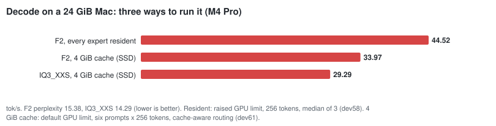
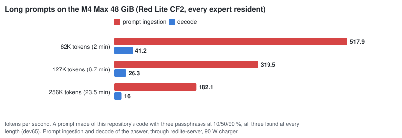
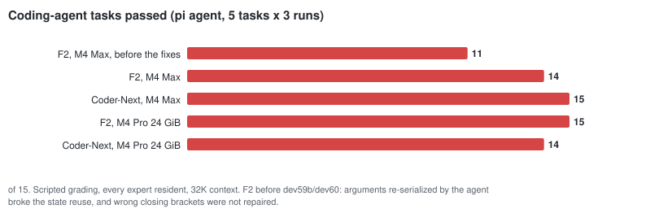
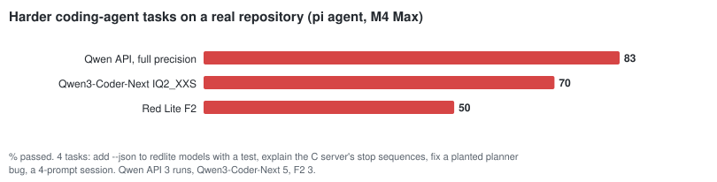
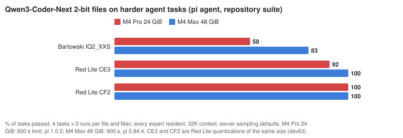
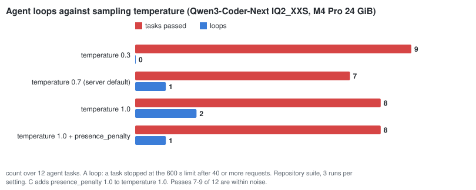
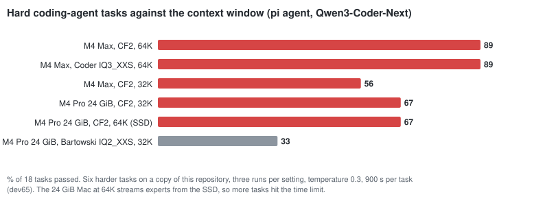
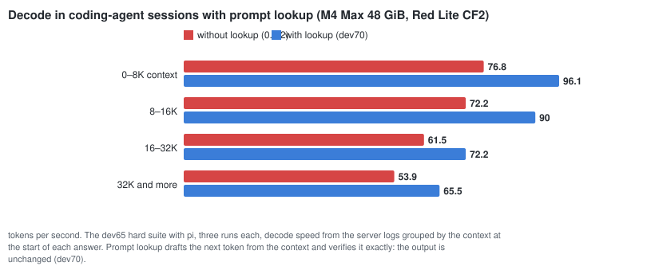
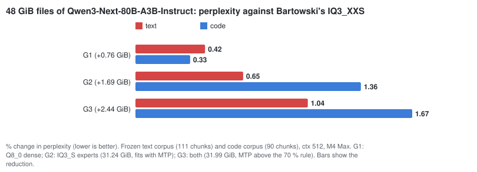

# What we learned

What building a single-model runtime for Qwen3-Next-80B-A3B on Apple Silicon taught us: what made it fast,
what did not, and where the limits are. Every number names its machine and comes from a record in
`benchmarks/` (the milestone documents have the commands). The charts are drawn from
`benchmarks/charts.json` by `scripts/dev/make_charts.py` and are redrawn whenever a milestone measures
something new.

Machines: an **Apple M4 Max with 48 GiB** (the development machine) and an **Apple M4 Pro with 24 GiB** (the
target class). No result is carried over from one to the other.

## 1. The idea: an 80B model that touches 3 % of itself per token

Qwen3-Next-80B-A3B has 48 layers. Each layer ends in a mixture of 512 experts, of which a token uses 10.
Of the 18 GiB IQ2_XXS file, only about 1 GiB is dense weights that every token needs. The other ~17 GiB are
experts, and one token reads about 3 % of them.

So Red Lite keeps the dense part resident and treats the experts as a cache:

- **24 GiB Macs:** a 4 GiB expert cache. The process uses about 5 GiB in total and leaves the rest of the
  memory to macOS.
- **48 GiB Macs:** every expert resident (17.3 GiB). Then a whole token can be routed on the GPU in one command
  buffer, with no CPU round trip between layers.

## 2. Where a token's time goes

With every expert resident, a token takes 12.1 ms on the M4 Max. A third of that is the 10 routed experts.
DeltaNet is the next largest block: its projections, state update and tail, 36 of the 48 layers. Attention is
small at short context, because only 12 layers have it. This profile decided what to optimize next. It is also
why speeding up encoders and barriers alone gained little (see section 7).

## 3. Speed by release, against llama.cpp

  
  

The reference is the same llama.cpp commit that Red Lite uses as its correctness oracle, measured on the same
token ids.

- **Decode:** level with llama.cpp in 0.3.0, 12 % ahead in 0.4.1 and 19 % in 0.5.0 (86.2 vs 72.5 tok/s), mostly from GEMV kernels
  written for the exact quant types of this file, and from concurrent encoders with barriers only between
  dependent dispatches.
- **Prompt ingestion:** 4× slower than llama.cpp in 0.3.0. Now on par (899 vs 894 tok/s at 8192 tokens) even
  with only a 4 GiB expert cache. What got there:
  - batched matrix kernels for experts and DeltaNet;
  - tiled attention;
  - a background thread that loads the next layer's experts during compute;
  - 2048-token chunks, so a bounded cache reloads each expert fewer times.

**Against MLX** (dev72, M4 Max, Qwen3-Coder-Next, two prompts, greedy):
- **MLX's 3-bit file** (32.5 GiB) decodes at 94–96 tok/s against Red Lite CF2's 80 in 0.9.1 (109 with prompt lookup on
  a file rewrite), and ingests prompts about 50 % faster (1,427 against 929 tok/s at 1.7K tokens).
- **0.9.2 closed the decode gap** (dev74): CF2 decodes at 97.8 tok/s on the same Mac, after four kernels were rewritten
  from the profile of a real token. The largest cost was not the experts but the Q4_K dense projections (864 MiB per
  token). Prompt ingestion is still about a third slower than MLX.
- **MLX's 2-bit file** (23.2 GiB) is faster still, but corrupted the file it was asked to copy; CF2 copied it exactly.
- **Neither MLX file runs on a 24 GiB Mac.** The gap says Red Lite's kernels have room; dev72 started profiling them.

## 4. Speculative decoding that never changes the answer (MTP)

Qwen3-Next was trained with a **multi-token prediction** (MTP) block: a small extra layer that guesses the
token after next. The GGUF files leave it out, so Red Lite loads it from a separate 2.26 GiB file. Each step,
it decodes the pending token and the guess together, in one pass over the weights.

The guess is accepted only if it is exactly the token that decoding would have produced, with whatever sampler
is in use. So **the output is identical**, not merely similar. The gain depends on how predictable the text is:

| text | gain |
|---|---|
| code and arithmetic | +26–30 % (guess accepted 84 % of the time) |
| creative prose | +8–10 % (accepted 58–62 %) |
| interactive chat on code | 88.7 → 108.6 tok/s |

Three details made the paired pass cheap:

- kernels that decode each weight block once for both tokens: computing two dot products separately cost
  1.74× one, not ~1.06×;
- DeltaNet state snapshots written inside the kernel, so a rejected guess is undone by swapping two pointers;
- the two tokens' experts merged into one dispatch.

MTP is on by default in `redlite chat` and `redlite serve --native` when the head file is present and every
expert is resident. On a 24 GiB Mac that needs a raised GPU limit (section 5): there it gains +15 % median
(46 → 52.7 tok/s, up to 55.7 on code). With the bounded cache it does not apply: checking two tokens loads the
union of their experts.

**MTP and long contexts** (dev55). The 2-row verify reads the attention cache twice, so the gain shrinks as the
context grows.
- **M4 Pro** (half the M4 Max's memory bandwidth): +24 % at a 20-token prompt, +4 % at 5.6K, 0 % at 11.2K,
  −12 % at 16.8K.
- **M4 Max:** still +2 % at 16.8K.
- **What the product does:** below 40 GiB, `redlite chat` and `serve` skip MTP for answers that start past 8,192
  positions (`--mtp-max-context`).

**Two requests in one pass** (dev56). The same 2-row pass can carry two different conversations instead of one
conversation's next two positions. `redlite serve --native --parallel 2` does that when two requests decode at the
same time:
- answers identical to serving them in turn;
- total throughput on the M4 Pro +28 % without MTP (43.5 → 55.9 tok/s) and +10 % against MTP (51.0 → 56.0);
- each answer is slower, about 29 tok/s instead of 46.

## 5. 24 GiB Macs: what the expert cache needs

  
  

Measured on the M4 Pro 24 GiB, 4 GiB expert cache, six prompts:

| change | misses per token | decode | effect |
|---|---:|---:|---|
| prefetch off vs on | 45.5 vs 29.5 | 29.2 vs 32.7 tok/s | **prefetch is worth 12 %** |
| uniform slots vs slot size classes (dev37) | 39.3 vs 29.5 | +1.6 % | layers with smaller experts fit more of them |
| cache-aware routing, λ = 0.5 (default with a bounded cache since dev51c) | 22.9 | +5 % | output changes; perplexity (17.586 → 17.583) and agreement with Qwen's API (8.1 vs 7.8 % median) did not |
| uncached reads (`F_NOCACHE`) | 29.5 | no change | — |

- **Prefetch:** applying the next layer's router to the current layer's input predicts most of the experts
  that layer will choose. The CPU loads them while the GPU is still computing.
- **Slot size classes:** with per-layer slot sizes the cache misses 25 % less often.
- **Cache-aware routing:** prefers experts that are already loaded when the router's scores are close. It
  changes the output but no quality measure moved, so `redlite chat` uses it with a bounded cache
  (`--exact-routing` turns it off).

**Smarter replacement than LRU does not pay.** On recorded routing traces, decayed-frequency and segmented LRU
save at most 5 % of misses. Even a clairvoyant policy, which knows the future, would only halve them (34.7 vs
64.1 misses per token in simulation).

**A bigger cache does not help either** (dev51). From 4 to 14 GiB, misses fell from 29.5 to 12.6 per token, but
decode stayed at 31–32 tok/s. With a bounded cache the engine waits for the GPU once per layer, 48 times per
token, and that round trip is the bound, not the loading.

**What does help: every expert resident.** macOS lets the GPU use 17.76 GiB on a 24 GiB Mac, just under the
18.4 GiB of IQ2_XXS's experts plus dense weights. With the limit raised (`sudo sysctl iogpu.wired_limit_mb`,
until reboot), the whole token runs on the GPU in one command buffer:

| M4 Pro 24 GiB, IQ2_XXS | decode | memory in use |
|---|---:|---:|
| 4 GiB expert cache | 32.5 tok/s | ~5 GiB |
| llama.cpp launcher (whole model resident) | 36–38 tok/s | ~18 GiB |
| every expert resident | **46.0 tok/s** | ~18 GiB |
| every expert resident + MTP | **52.7 tok/s** | ~20 GiB |

The trade-off is memory: about 1.3 GB of other apps went to swap and stayed there. `redlite doctor` prints the
limit to set; `redlite chat` picks full residency (and MTP) on its own once the limit allows it.

**Long contexts within the raised limit** (dev55). The GPU memory full residency needs was measured as a function
of the context, the prefill chunk and MTP:

    slots + dense + 580 MiB + 48 KiB per position + 572 MiB for 2048-token chunks + 1,787 MiB for MTP

`redlite chat` and `serve` use it to choose what fits. At a 21,741 MiB limit:

| context | prefill chunks | MTP |
|---|---|---|
| 4K | 2048 | yes |
| 16K | 512 | yes |
| 32K | 2048 | no |

A 16.8K-token prompt in a 32K context now reads at 358 tok/s and decodes at 36.4 tok/s; before, it ran out of GPU
memory with MTP on.

**Setting the limit for good** (dev55b). `sysctl` only lasts until a restart. A small LaunchDaemon sets the limit at
every boot (recipe in `docs/REDLITE_DEV51_24GB_DECODE.md`), and `redlite doctor` recognizes it. Verified on the M4
Pro: the limit is applied, and Metal then reports 21.23 GiB.

Since the dev18 build of September (27.8 tok/s decode; prompts ingested one token at a time at 16 tok/s), the
24 GiB numbers rose to 46–53 tok/s decode and about 360 tok/s ingestion.

**The better file from the SSD** (dev61).
- **What runs:** a 24 GiB Mac at the default GPU limit can stream the 29.6 GiB IQ3_XXS file (perplexity 14.29)
  through the 4 GiB cache.
- **Speed:** it decodes at 29.3 tok/s against 34.0 for F2, though it reads 2.6× more per token. The per-layer
  round trip bounds that path, not the SSD.
- **Bigger caches:** 8 and 12 GiB cut the reads but not the time.
- **Agents:** the coding-agent tasks pass from the SSD as well (F2 and Qwen3-Coder-Next 15/15), 20–50 % slower
  than resident.

## 6. Long context, up to the model's 262K

Each position costs 48 KiB of attention cache. Only 12 of the 48 layers keep one; the DeltaNet layers have a
fixed 72 MiB state instead. So 64K positions need about 3 GiB, 128K about 6 GiB, and the model's full 262K about
12 GiB.

**The model reads all of it** (dev65). A prompt of this repository's own code, with three passphrases hidden in
comments at 10 %, 50 % and 90 % of it: Qwen3-Coder-Next (Red Lite CF2) found all three at 62K, 127K and 256K tokens on
the M4 Max, and at 62K and 127K on the 24 GiB M4 Pro with experts streamed from the SSD.

- **Decode** reads the whole attention cache for every token, so it slows down with length: 48 tok/s at 62K, 33 at
  127K, 22 at 256K on the M4 Max. dev66 made it 16–35 % faster: the value pass of the decode attention kernel waited
  on one load at a time; with four in flight, the cache is read at about 415 GB/s instead of 290. dev67 added 4–13 %
  at 64K–256K (`decode-bench`: 56, 42 and 27 tok/s at 64K, 128K and 256K) by reading key rows in whole cache lines
  and parallelizing the merge of the partial results; the attention now reads about 480 GB/s.
- **The first ingestion** is the long wait: 2 minutes at 62K, 7 at 127K, 24 at 256K. An agent pays it once, since
  later turns reuse the state. A prefill attention kernel with 16-token tiles made it 20–29 % faster at 32–64K
  (dev65), bit-identical to the old one.
- **24 GiB Mac:** 168 / 15 tok/s at 62K and 96 / 10.5 at 127K (ingestion / decode, 0.8.0), 4 GiB expert cache.
  The dev66 kernel cut attention there by about a third too (`kernel-bench`); decode with experts from the SSD
  measured 17.4 → 20.5 tok/s at 64K and 12.6 → 16.1 at 128K (`decode-bench`, warm runs).
- **Agreement with llama.cpp:**
  - the top token agrees at every position checked up to 128K (50 / 50 at 32K, 64K and 128K, 100 / 100 at 16K);
  - per-layer dumps (dev72) show where the rest comes from: summing tens of thousands of positions in another order
    gives about 1e-5 at the first attention layer, and the MoE router occasionally turns that into a jump when two
    experts are near a tie;
  - the distributions drift apart slowly with length: KL 1.5e-4 at 32K, 1.2e-3 at 64K, 0.025 at 128K. The two
    programs sum attention over hundreds of thousands of positions in a different order.
- **Float16 KV cache** (dev53) halved the context memory without changing the speed. It moved a few expert choices
  between the CPU reference and Metal, which the parity rules do not allow, so it was not kept.
- **Half KV cache, opt-in** (dev74, `RL_KV_F16=1`): since dev66/67 the decode attention is bound by memory, so half
  K/V now pays: +9 % decode at 32K and +13 % at 64K (M4 Max, CF2), and MTP plus a 32K context fits a 24 GiB Mac with
  every expert resident. The CPU oracle rounds K/V the same way, and the reference file passed all 59 regression
  checks. On CF2 the 1200-token comparison with llama.cpp went past its bounds (KL 5.8e-2, one argmax), so float
  stays the default.

## 7. How we know it is correct

- **Model-free tests.** Every native stage has a CPU reference in double precision, and Metal is compared with
  it.
- **Real-model checks against llama.cpp.** The pinned llama.cpp is used only as an oracle, never linked into a
  runtime binary. Each change is checked against it on the real model: tokenizer, logits, 24 greedy tokens and a
  1200-token long context. `scripts/regress_m4.sh` runs 51 such checks.
- **Router mismatches are hard failures.** If the selected experts differ between the CPU and Metal, the change
  is reverted. Small floating-point drift is compared across the whole stack, not stage by stage.
- **Against the model maker's own API (dev48).** 235 prompts, compared word for word with Alibaba Cloud's Qwen3-Next.
  IQ3_XXS is about twice as close as IQ2_XXS: 10 vs 2 identical answers; the median share of words matching from
  the start is 15.6 % vs 7.8 %. Greedy answers diverge early once one word differs, so the comparison between
  files says more than the absolute numbers. If you have the memory, IQ3_XXS is the more faithful file.

  

- **The 24 GiB Mac.** llama.cpp itself runs out of GPU memory there with the whole model resident. Instead, the
  M4 Pro's own outputs were compared with the M4 Max's (which match llama.cpp), and they are bit-identical:
  logits, the long-context dump, greedy tokens and tokenizer.

## 8. A better file at the same size

Bartowski's IQ2_XXS keeps 11 of the 48 expert layers at the higher precision (IQ2_XS), half of them the first six.
Bartowski's importance matrix shows that the experts' input energy grows steadily with depth, 400× from layer 0 to
47. Moving the 11 precise layers to 37–47, with every other tensor unchanged:

| | Bartowski's scheme (rebuilt) | Red Lite E3 |
|---|---:|---:|
| size | 19.30 GB | 19.30 GB |
| perplexity | 16.370 | **16.216** (paired t = −3.9) |
| answers identical to Qwen's API | 2 / 235 | **4 / 235** |

E3 is on Hugging Face ([alfodaniello/Qwen3-Next-80B-A3B-Instruct-RedLite-GGUF](https://huggingface.co/alfodaniello/Qwen3-Next-80B-A3B-Instruct-RedLite-GGUF)),
and `redlite download 24gb` fetches it.

**The dense weights matter more** (dev58). In E3 the projections that every token reads (DeltaNet and attention
inputs, part of the shared expert) are still 2-bit: about 290 MiB of a 19.3 GB file. Raising them to IQ3_XXS (F1) or
Q4_K (F2), and paying with one or three expert layers back at IQ1_M, keeps the size:
- **perplexity −5 % against E3:** 15.42 (F1) and 15.38 (F2) against 16.22, better on 103–105 of 111 chunks;
- **API agreement:** F2 reaches 5 identical answers and 15.2 % mean matching words (E3: 4, 13.6 %);
- **speed:** plain decode 1–3 % slower; with MTP on the M4 Pro as fast as E3 or faster.

## 9. A coding agent on a 24 GiB Mac

The server speaks OpenAI tool calling (dev59), so a coding agent such as pi runs against it with a configuration
file. Five scripted tasks were run three times each, every expert resident, 32K context:
- write code and its tests;
- fix a bug without touching the tests;
- rename across files;
- answer from a file;
- add a command-line flag.

| model, Mac | tasks passed | time per task (median) |
|---|---:|---|
| Qwen3-Coder-Next IQ2_XXS, M4 Max | 15 / 15 | 3–11 s |
| Red Lite F2, M4 Max | 14 / 15 | 3–13 s |
| Red Lite F2, M4 Pro 24 GiB | 15 / 15 | 6–29 s |
| Qwen3-Coder-Next IQ2_XXS, M4 Pro 24 GiB | 14 / 15 | 6–21 s |

The first measurement found three problems, all fixed:
- **State lost between turns.** An agent repeats the whole conversation on every turn; the engine keeps its state
  only when the new prompt extends the old one byte for byte. With F2, re-serialized call arguments and one extra
  newline broke that, and most turns re-read the whole prompt. Now 57–83 % of each task's prompt is reused.
- **Wrong closing brackets.** The 2-bit model wrote the right edit with the wrong closing brackets. They are now
  repaired, and F2 went from 11 to 14 of 15.

**Harder tasks** (dev62). The full-precision model behind Qwen's API also passes those five tasks, so four harder
ones were run on a copy of this repository:
- extend the CLI with a test;
- explain part of the C server;
- fix a planted bug;
- a four-prompt session.

They separate the models:
- full precision 83 %;
- Qwen3-Coder-Next at 2 bits 70 %;
- F2 50 %.

For agents, use the coding model. On the same Mac two agents at once gain only 2–5 % (`--parallel 2`), because an
agent turn is mostly prompt ingestion. Cache-aware routing costs at most 0.2 % in perplexity.

**A better Qwen3-Coder-Next file** (dev63). F2's recipe applied to the coding model gives **CF2**, the same size as
Bartowski's IQ2_XXS (19.32 GB):
- **perplexity on code −3.3 %** (t = −4.0), and no better than Bartowski's on prose;
- **the harder tasks:** 12 of 12 on both Macs, against 7 (M4 Pro) and 10 (M4 Max) for Bartowski's file, with no
  task over 270 s and never more than 16 requests;
- `redlite download coder` fetches it.

**Loops and temperature** (dev63). The 2-bit models sometimes repeat the same tool call until the time limit.
On the M4 Pro, twelve tasks per setting with Bartowski's Coder file:
- four loops in 36 sessions at temperature 0.7 and above, the longest 349 requests at 1.0 (the value Qwen's card
  suggests);
- **none at 0.3**, where no task needed more than 19 requests;
- `presence_penalty` (now supported by the server) shortened a loop but did not remove it.

The pass rates (7–9 of 12) are within noise, so this is a direction, not a proof. `redlite setup-pi` now sets
temperature 0.3 for the agent.

**The context window matters more than the file** (dev65). Six harder tasks, three runs each. On the same M4 Max,
CF2 passed 16 of 18 with a 64K window and 10 of 18 with 32K: these sessions reach 10–30K tokens per request, so a
32K window fills mid-task and the agent loses its earlier turns. With 64K, CF2 matches Bartowski's 3-bit Coder
(16 / 18) at 12 GB less. `redlite setup-pi` now writes a 64K window. On a 24 GiB Mac 64K streams the experts from the
SSD; the pass rate stays at 12 / 18, with more tasks at the time limit.

**Faster agents with prompt lookup** (dev70). Qwen3-Coder-Next has no MTP block, but a coding agent copies much of
what it writes from the conversation: files it rewrites, names, paths. `redlite serve` now drafts the next token
from the context (the token that followed the latest earlier occurrence of the last three) and checks it exactly in
the same 2-row pass as MTP. **The answer does not change.** In the hard suite on the M4 Max, 73–79 % of the drafts were
accepted and decode was 15–25 % faster at every context length, in two separate sets of runs (the time for the
whole suite varied more with what the agent did: 37 and 50 minutes with lookup, 52 without). Rewriting a file:
80 → 109 tok/s on the M4 Max, 45 → 60 on the M4 Pro. On the 24 GiB M4 Pro with every expert resident (raised GPU
limit, 32K window) the agent decoded 28–29 % faster. `redlite chat` does it too. Since dev72 it also works with a
bounded expert cache: on the M4 Pro with the default 4 GiB cache and a 64K window, agent decode was 7–10 % faster than
the cache-aware routing that had been the default there, with exact answers.

**A trap on the way.** The first run of this study passed at most 2 of 4 tasks on the M4 Pro. Two of the repository's
own tests read the machine's GPU limit, raised on that Mac, so they failed before the agent did anything, and the
tasks that run them could not pass. Running the checks on an untouched copy on the same machine found it.

## 10. 48 GiB Macs: a better file in the remaining room

Bartowski's IQ3_XXS (29.55 GiB) leaves room on a 48 GiB Mac, so dev64 tried spending it, from the same Q8_0 source:
- **G1, the dense weights at Q8_0:** −0.4 % perplexity. At 3 bits the dense part is not the bottleneck.
- **G2, IQ3_S experts** on more layers (31.24 GiB): −0.65 % on text and −1.4 % on code, both clearly beyond noise,
  and the same decode speed as IQ3_XXS with MTP (90.7 against 89.3 tok/s on the M4 Max). It passes the parity
  checks.
- **G3, both:** the best perplexity, but with MTP it is above the planner's 70 %-of-RAM rule, so it would run without
  MTP, 20 % slower.

**Long prompts show the limit.** With 25K-token prompts G2's prompt ingestion ranged from 401 to 676 tok/s, each slow
request with the Mac swapping, while IQ3_XXS stayed at 596–638. Decode was unaffected. So G2 is an option
(`redlite download 48gb-g2`), and `48gb` stays IQ3_XXS. The 70 % rule now also counts the context's KV cache, and
`chat` / `serve` turn MTP off when it does not fit at the chosen context.

## 11. What did not work

[WHAT_DID_NOT_WORK.md](WHAT_DID_NOT_WORK.md) lists every reverted attempt with its measurement. Highlights:

| attempt | result | lesson |
|---|---|---|
| reading experts in place from the memory-mapped file | 4–10× slower prompt ingestion | Metal re-establishes residency of each layer's expert window for every command buffer; copy into owned slots |
| spin-waiting on command buffer status | 44.6 → 27.5 tok/s | polling fights the driver's completion path |
| removing *all* GPU barriers (as a bound) | 118 tok/s, wrong output | most dispatches depend on the previous one; the correct version gains 2–6 % |
| one fewer encoder per token (1,200 → 1) | +1.9 % | encoder boundaries are cheap on Apple GPUs; the time is inside the kernels |
| staging codebooks in threadgroup memory (what llama.cpp does) | no gain | lookups from `constant` memory were not the bound once the GPU was warm |
| 32-pair prefill expert tiles instead of 16 | 400 vs 872 tok/s | register pressure; per-thread work, not decode reuse, sets the speed |
| chunk-parallel DeltaNet prefill (as in MLX) | not built: at most ~2 % | measured first: the recurrence is 6.7 % of an 8K-token ingestion |
| IQ3_M (a larger quant) on 48 GiB | slower than IQ3_XXS, perplexity within the error bar | full residency ran out of GPU memory; the planner rule went from 75 % to 70 % of RAM |
| agent pass rates on the M4 Pro (dev63) | at most 2 of 4 tasks per run | two tests read the machine's raised GPU limit; check the task checks on an untouched copy first |

Traps that cost time and are now guarded:

- **Benchmark conditions:** the M4 Max decoded at less than half speed on battery, and back-to-back prompt
  runs throttled to a third of the speed. Only cooled, alternated, same-session runs on AC power are compared.
- **A stale binary:** a release table was once measured on an outdated build.
- **Weak checks:** a parity check passed on an empty dump. The checks now refuse empty or stale inputs.

## Updating these pages

When a milestone measures something that belongs in a chart:

1. Record the measurement as JSON in `benchmarks/`.
2. Add the row to `benchmarks/charts.json`, naming that record in the chart's `sources`.
3. Run `python3 scripts/dev/make_charts.py`.

`tests/test_charts.py` fails if a committed chart is out of date or cites a record that does not exist.
