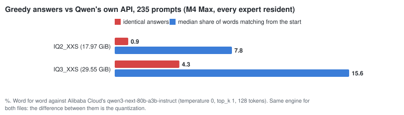

# Red Lite dev48 — answers compared with Qwen's own API

Status: on branch `dev48/api-reference`; measured on the Apple M4 Max 48 GiB on 2026-10-02.

## Why

The pinned llama.cpp checks that Red Lite runs a quantized GGUF correctly, and it does: logits, greedy tokens
and long context match. But both read the same 2- or 3-bit file. Neither can say how far that file is from the
model its maker serves.

antirez checks ds4 the other way: he asks the model maker's API about 1000 questions and compares the answers
word for word (`docs/RESEARCH_2026_10.md` section 6). dev48 adds that check for Qwen3-Next.

## The reference

**Endpoint:** Alibaba Cloud Model Studio (international), `qwen3-next-80b-a3b-instruct`, through the
OpenAI-compatible chat API.

**Prompts:** 235, in `tests/fixtures/api_prompts.txt`: facts, science, reasoning, math, code, Italian, writing
and instructions (about 30 each).

**API answers:** 128 tokens each, stored once in `tests/fixtures/qwen_api_reference.json`. The comparison can be
repeated without a key. Fetching cost about 0.04 USD (4,846 prompt tokens, 28,429 output tokens).

Two API traps:
- **`temperature: 0` alone is not deterministic.** One run in three gave a different text. With `top_k: 1`, four
  runs gave the same text on each of three prompts. The reference uses `temperature: 0, top_k: 1`.
- **The returned logprobs are misaligned.** On a 30-token answer, the chosen token was missing from its own top-5
  list at 23 positions, identically on repeated calls. The values seem to belong to other positions; one guess
  is speculative decoding on the server. So only text is compared, not distributions.

The chat template agrees with ours: every one of the 235 prompts has the same prompt token count on both sides.

## Results (M4 Max 48 GiB, every expert resident, `redlite-server` greedy)

`python3 scripts/dev/api_compare.py compare MODEL --cache-mib full --json OUT`:

| | IQ2_XXS (17.97 GiB) | IQ3_XXS (29.55 GiB) |
|---|---:|---:|
| answers identical to the API | 2 / 235 | 10 / 235 |
| median share of the API answer's words that match from the start | 7.8 % | 15.6 % |
| median / mean number of matching words from the start | 6 / 8.4 | 11 / 15.8 |
| first word already different | 32 | 15 |
| identical, by category | science 1, Italian 1 | facts 2, science 1, reasoning 2, math 4, Italian 1 |

- **IQ3_XXS is about twice as close to the API as IQ2_XXS** on every measure. The engine is the same for both
  files, so this difference is the quantization.
- **Early divergence is normal for word-for-word greedy.** Once one token differs, the rest of the answer
  follows another path. Where the first difference falls says more than how many answers are identical.
- **Short answers.** 35 API answers end before 128 tokens. Ours are more than 1.5 times longer in 3 of those 35
  (IQ2_XXS) and 1 (IQ3_XXS). Not ending a short answer happens, but is rare.
- **What the divergences look like.** Most are wording: "A vaccine trains the immune system by safely exposing
  it..." vs "Vaccines train the immune system by mimicking an infection...". This check does not judge which
  answer is correct.

## How to use it

- After a change that may affect numerics, run `api_compare.py compare` on both files. A drop in these numbers
  with an unchanged GGUF means an engine problem; the llama.cpp oracle should catch it too.
- To compare a new quantization (for example a future Red Lite quant), run the same command on it. The numbers
  are comparable as long as the reference file and the prompts do not change.
- `python3 scripts/dev/api_compare.py fetch` needs a key in `$DASHSCOPE_API_KEY` or
  `~/.config/redlite/dashscope_key`, and only fetches prompts that have no answer yet.
  `tests/test_api_reference.py` fails if a prompt has no stored answer.

## Scope boundary

- **We do not know the API's own precision.** Alibaba does not say whether it serves bf16 or a lower precision,
  so "distance from the API" is not necessarily distance from the bf16 checkpoint.
- **Agreement is not correctness.** No human or model judged which answers are right.
- **One machine.** Only the M4 Max was measured. The M4 Pro's outputs are bit-identical to the M4 Max's on the
  regression prompts (dev47), but this set was not run there.
- **Not a distribution metric.** No KL or top-k agreement, because the API's logprobs are unusable.
